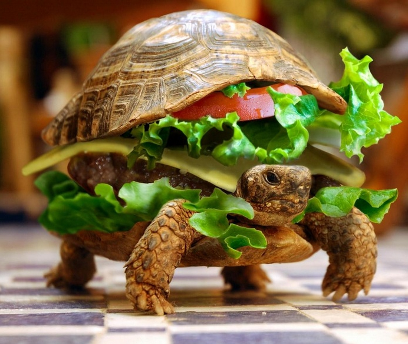

<h1 style="color:green">Fast-Food App</h1>

# Projet Appli Mobile CodaFôÔD

## Objectif
* Créer une appli mobile à l'aide d'un **framework js** (Meteor, Ionic...) 
qui permette de proposer un service de **restauration rapide à domicile**
* Les ressources graphiques sont fournies mais vous pouvez en choisir d'autres !

## Partie 1

#### Page d'acceuil
* Réaliser une page d'acueil affichant :

    1/ Le logo est le nom de l'établissement.
       (voir ressources images ou créer le logo)
    
    2/ Une présentation des différentes catégories de produits :

      - Pizzas
      - Burgers
      - Salades
      - Boissons
      - Desserts  
     
* Un menu comprenant :
     
     - Une section **login / Inscription**
     - Une section **panier** 
     - Une section **contact** 

#### Page login

* Créer un formulaire permettant de **s'inscrire** avec :  
   
   **Attention !** Pour pouvoir s'inscrire il faut figurer parmi les codes postaux dans un rayon de 10kms ([déterminer les codes postaux](http://www.codepostauxfrance.com/rayon-de-recherche-par-code-postal))
   Donc prévoir un champ pour connaitre le code postal de l'utilisateur et seulement après validation du code postal, proposer le formulaire d'inscription avec :
     
      - Nom
      - Prénom
      - email 
      - Mot de passe
      - Numero de téléphone
      - Adresse de livraison(numero de rue, nom de rue, ville)
      - Commentaire(pour un accès difficile...)
      
    Sinon, prévoir un message **"Nous ne livrons pas ce code postal, veuillez nous en excuser."** 

* Créer un formulaire permettant de **se loguer** avec :

      - email     
      - Mot de passe
             
     
#### Page panier

1/ Afficher le détail de la commande en cours en indiquant pour chaque produit commandé :
   
     - Le produit
     - La quantité
     - Le prix unitaire
     - Le prix 
    
2/ Afficher également :
    
      - Le montant TOTAL de la commande 
      - Un bouton (de type submit...)->COMMANDER

#### Page contact 

* Afficher :
   
      - Le plan
      - l'adresse
      - Le numero de téléphone de CodaF(ôÔ)D

#### Page détail produit
* Lors du clic sur une catégorie(Pizzas, Salades, Burgers...) afficher :

      - La photo du produit
      - Le nom du produit
      - La description du produit
      - Le prix du produit
      - Un input (de type number...) pour choisir la quantité  
      - Un bouton ajouter pour mettre le produit dans le panier

_____________

## Partie 2

* Créer un utilisateur admin qui peut gérer toute l'application :

      - Gérer les clients(modification ou suppression de profil)
      - Gérer les produits(modification, ajout/suppression de produits) 
      - Gérer les commandes(priorisation, suppression)

**Bonus** Créer une intro(launcher screen) pour l'appli et une icone(launcher) !